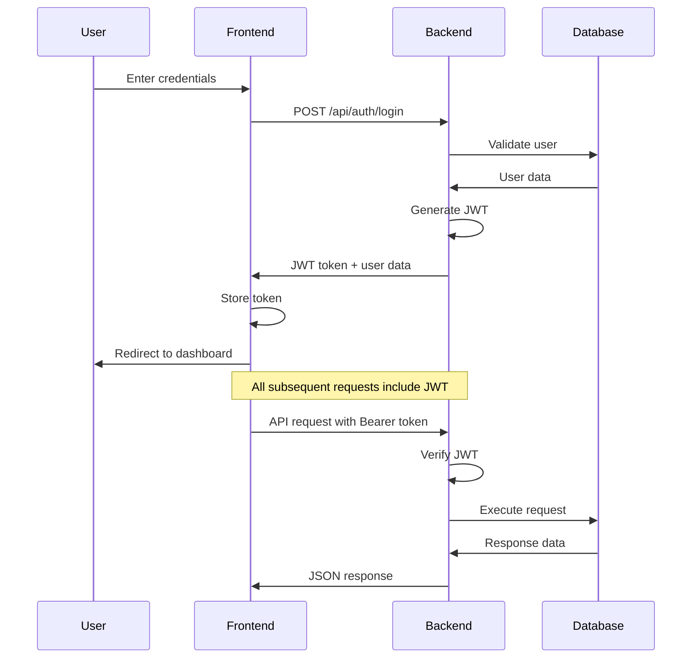
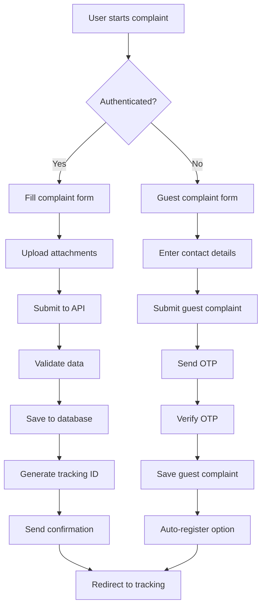
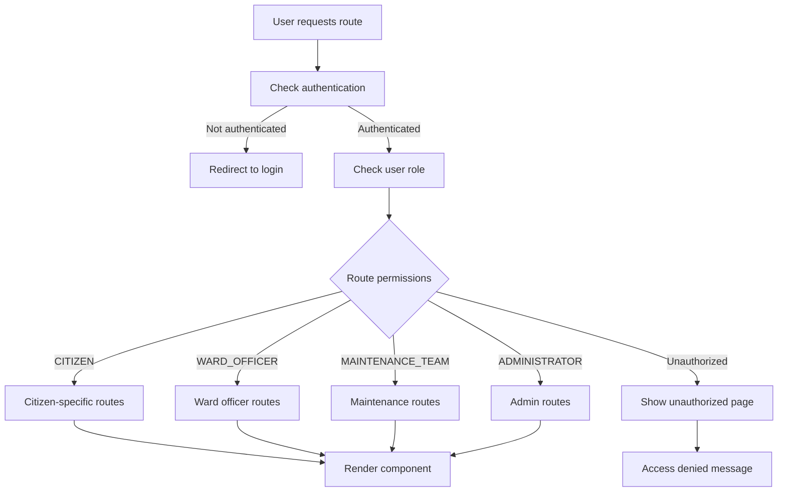

# Cochin Smart City Complaint Management System - Architecture

## Table of Contents

1. [High-level System Overview](#high-level-system-overview)
2. [Technology Stack](#technology-stack)
3. [Module Breakdown](#module-breakdown)
4. [Database Architecture](#database-architecture)
5. [API Architecture](#api-architecture)
6. [Frontend Architecture](#frontend-architecture)
7. [Security Architecture](#security-architecture)
8. [Deployment Architecture](#deployment-architecture)
9. [File Structure](#file-structure)
10. [Data Flow Diagrams](#data-flow-diagrams)
11. [Scalability Considerations](#scalability-considerations)

---

## High-level System Overview

The Cochin Smart City Complaint Management System is a comprehensive full-stack web application designed to streamline civic complaint handling between citizens and municipal authorities. The system follows a modern microservice-inspired architecture with clear separation of concerns.

### Core Architecture Principles

- **Separation of Concerns**: Clear division between frontend, backend, and data layers
- **Role-Based Access Control (RBAC)**: Multi-tiered permission system
- **RESTful API Design**: Standardized HTTP methods and response patterns
- **Component-Based Frontend**: Modular, reusable React components
- **Type Safety**: End-to-end TypeScript implementation
- **Progressive Enhancement**: Graceful degradation for various user types

### System Boundaries

```
┌─────────────────────────────────────────────────────────────┐
│                    EXTERNAL SYSTEMS                        │
├─────────────────────────────────────────────────────────────┤
│  • SMTP Email Service                                      │
│  • SMS Gateway (Future)                                    │
│  • File Storage (Local/Cloud)                             │
│  • Authentication Providers (JWT-based)                   │
└─��───────────────────────────────────────────────────────────┘
                              │
                              ▼
┌─────────────────────────────────────────────────────────────┐
│                    COCHIN SMART CITY SYSTEM                │
├─────────────────────────────────────────────────────────────┤
│  ┌─────────────────┐  ┌─────────────────┐  ┌──────────────┐ │
│  │   FRONTEND      │  │    BACKEND      │  │   DATABASE   │ │
│  │   (React SPA)   │◄─┤   (Express.js)  │◄─┤  (SQLite/    │ │
│  │                 │  │                 │  │  PostgreSQL) │ │
│  └─────────────────┘  └─────────────────┘  └──────────────┘ │
└───��──────��──────────────────────────────────────────────────┘
                              │
                              ▼
┌─────────────────────────────────────────────────────────────┐
│                      USER TYPES                            │
├─────────────────────────────────────────────────────────────┤
│  • Guest Users (Anonymous)                                 │
│  • Citizens (Registered)                                   │
│  • Ward Officers                                           │
│  • Maintenance Teams                                       │
│  • System Administrators                                   │
└─────────────────────────────────────────────────────────────┘
```

---

## Technology Stack

### Frontend Technologies

#### Core Framework

- **React 18.3.1**: Modern React with concurrent features
- **TypeScript 5.5.3**: Static type checking and enhanced developer experience
- **Vite 6.2.2**: Next-generation frontend build tool with HMR

#### State Management

- **Redux Toolkit 2.8.2**: Predictable state container
- **React Redux 9.2.0**: Official React bindings for Redux
- **RTK Query**: Data fetching and caching solution

#### Routing & Navigation

- **React Router 6.26.2**: Declarative routing for React applications
- **SPA Mode**: Single Page Application architecture

#### UI Framework & Styling

- **TailwindCSS 3.4.11**: Utility-first CSS framework
- **Radix UI**: Low-level UI primitives for accessibility
- **Lucide React 0.462.0**: Modern icon library
- **Framer Motion 12.6.2**: Production-ready motion library

#### Form Management

- **React Hook Form 7.53.0**: Performant forms with easy validation
- **Zod 3.23.8**: TypeScript-first schema validation

#### Development Tools

- **Vitest 3.1.4**: Vite-native unit test framework
- **Cypress**: End-to-end testing framework
- **ESLint & Prettier**: Code quality and formatting

### Backend Technologies

#### Core Framework

- **Node.js 18+**: JavaScript runtime environment
- **Express.js 4.18.2**: Fast, unopinionated web framework
- **TypeScript**: Server-side type safety

#### Database & ORM

- **Prisma 5.7.1**: Next-generation Node.js and TypeScript ORM
- **SQLite**: Development database (file-based)
- **PostgreSQL 13+**: Production database (recommended)

#### Authentication & Security

- **JSON Web Tokens (JWT)**: Stateless authentication
- **bcryptjs 2.4.3**: Password hashing
- **Helmet 8.1.0**: Security headers middleware
- **CORS**: Cross-Origin Resource Sharing configuration
- **Express Rate Limit**: API rate limiting

#### API Documentation

- **Swagger/OpenAPI 3.0**: API documentation standard
- **swagger-jsdoc 6.2.8**: Swagger specification generator
- **swagger-ui-express 5.0.1**: Swagger UI middleware

#### File Management

- **Multer 1.4.5**: Multipart/form-data file upload handling
- **File System**: Local file storage with configurable paths

#### Communication

- **Nodemailer 7.0.5**: Email sending capabilities
- **SMTP**: Email delivery protocol

### Development & Deployment

#### Package Management

- **npm**: Package manager and script runner
- **Node.js 18+**: Runtime requirement

#### Build & Development

- **Concurrently**: Run multiple npm scripts simultaneously
- **Nodemon**: Development server auto-restart
- **Hot Module Replacement**: Live code updates

#### Production Deployment

- **PM2**: Production process manager
- **Nginx**: Reverse proxy and static file serving
- **Docker**: Containerization support
- **Cloud Platforms**: Heroku, Vercel, DigitalOcean compatibility

---

## Module Breakdown

### Frontend Modules

#### 1. Authentication Module (`client/store/slices/authSlice.ts`)

**Purpose**: Manages user authentication state and JWT tokens

**Features**:

- JWT token management
- User session persistence
- Role-based access control
- OTP verification flow
- Password reset functionality

**API Dependencies**:

- `POST /api/auth/login`
- `POST /api/auth/register`
- `POST /api/auth/verify-otp`
- `GET /api/auth/me`

#### 2. Complaint Management Module (`client/store/slices/complaintsSlice.ts`)

**Purpose**: Handles all complaint-related operations

**Features**:

- Complaint CRUD operations
- Status updates and tracking
- File attachment management
- Search and filtering
- Pagination support

**API Dependencies**:

- `GET /api/complaints`
- `POST /api/complaints`
- `PUT /api/complaints/:id/status`
- `POST /api/uploads/complaint/:id/attachment`

#### 3. Guest User Module (`client/store/slices/guestSlice.ts`)

**Purpose**: Manages anonymous user interactions

**Features**:

- Guest complaint submission
- OTP verification
- Complaint tracking
- Auto-registration option

**API Dependencies**:

- `POST /api/guest/complaint`
- `POST /api/guest/verify-otp`
- `GET /api/guest/track/:id`

#### 4. UI Component Library (`client/components/ui/`)

**Purpose**: Reusable UI components based on Radix UI

**Components**:

- Form controls (Button, Input, Select)
- Layout components (Card, Dialog, Sheet)
- Data display (Table, Badge, Alert)
- Navigation components

#### 5. Page Components (`client/pages/`)

**Purpose**: Route-specific page components

**Key Pages**:

- Dashboard pages (role-specific)
- Complaint management pages
- User management (admin)
- Reports and analytics

### Backend Modules

#### 1. Authentication Controller (`server/controller/authController.js`)

**Purpose**: Handles user authentication and authorization

**Endpoints**:

- User registration and login
- JWT token management
- OTP generation and verification
- Password reset workflows

#### 2. Complaint Controller (`server/controller/complaintController.js`)

**Purpose**: Manages complaint lifecycle

**Endpoints**:

- Complaint CRUD operations
- Status updates and assignment
- Feedback and rating system
- Statistics and reporting

#### 3. Guest Controller (`server/controller/guestController.js`)

**Purpose**: Handles anonymous user operations

**Endpoints**:

- Guest complaint submission
- OTP verification and auto-registration
- Public complaint tracking
- Public statistics

#### 4. Admin Controller (`server/controller/adminController.js`)

**Purpose**: Administrative operations

**Endpoints**:

- User management
- System analytics
- Bulk operations
- System configuration

#### 5. Upload Controller (`server/controller/uploadController.js`)

**Purpose**: File upload and management

**Endpoints**:

- File upload handling
- File serving and downloads
- File validation and security

#### 6. Middleware Layer (`server/middleware/`)

**Purpose**: Request processing and security

**Components**:

- Authentication middleware
- Authorization middleware
- Validation middleware
- Error handling middleware
- Request logging

### Database Module (Prisma Schema)

#### Core Models:

1. **User**: User accounts and profiles
2. **Ward**: Geographical divisions
3. **Complaint**: Core complaint entity
4. **StatusLog**: Complaint status history
5. **Attachment**: File attachments
6. **Notification**: System notifications
7. **OTPSession**: OTP verification

---

## Database Architecture

### Entity Relationship Diagram

```
┌─────────────┐       ┌─────────────┐       ┌─────────────┐
│    Ward     │       │    User     │       │ SubZone     │
├─────────────┤       ├─────────────┤       ├─────────────┤
│ id (PK)     │◄─────┤│ wardId (FK) │       │ id (PK)     │
│ name        │       │ id (PK)     │       │ wardId (FK) │◄─┐
│ description │       │ email       │       │ name        │  │
│ isActive    │       │ fullName    │       │ description │  │
└─────────────┘       │ role        │       └─────────────┘  │
                      │ isActive    │                        │
                      └─────────────┘                        │
                              │                              │
                              │submittedBy                   │
                              ▼                              │
                      ┌─────────────┐       ┌─────────────┐  │
                      │ Complaint   │       │ StatusLog   │  │
                      ├─────────────┤       ├─────────────┤  │
                      │ id (PK)     │◄──────┤ complaintId │  │
                      │ title       │       │ userId (FK) │◄─┘
                      │ description │       │ fromStatus  │
                      │ type        │       │ toStatus    │
                      │ status      │       │ timestamp   │
                      │ priority    │       └─────────────┘
                      │ wardId (FK) │
                      │ subZoneId   │◄──────────────────────┘
                      │ coordinates │
                      └─────────────┘
                              │
                              │
                              ▼
                      ┌─────────────┐
                      │ Attachment  │
                      ├─────────────┤
                      │ id (PK)     │
                      │ complaintId │
                      │ fileName    │
                      │ mimeType    │
                      │ size        │
                      └─────────────┘
```

### Database Schema Design Principles

#### 1. Normalization

- **Third Normal Form (3NF)**: Eliminates data redundancy
- **Referential Integrity**: Foreign key constraints maintain data consistency
- **Indexed Fields**: Performance optimization for frequent queries

#### 2. Scalability Considerations

- **Partitioning Ready**: Complaints can be partitioned by date or ward
- **Index Strategy**: Composite indexes on frequently queried combinations
- **Data Archival**: Status logs can be archived for historical analysis

#### 3. Data Types and Constraints

```sql
-- Example constraint patterns
CHECK (status IN ('REGISTERED', 'ASSIGNED', 'IN_PROGRESS', 'RESOLVED', 'CLOSED'))
CHECK (priority IN ('LOW', 'MEDIUM', 'HIGH', 'CRITICAL'))
CHECK (rating >= 1 AND rating <= 5)
```

---

## API Architecture

### RESTful Design Patterns

#### 1. Resource-Based URLs

```
GET    /api/complaints           # List complaints
POST   /api/complaints           # Create complaint
GET    /api/complaints/:id       # Get specific complaint
PUT    /api/complaints/:id       # Update complaint
DELETE /api/complaints/:id       # Delete complaint (admin only)
```

#### 2. HTTP Status Codes

- **200 OK**: Successful GET, PUT requests
- **201 Created**: Successful POST requests
- **400 Bad Request**: Client validation errors
- **401 Unauthorized**: Authentication required
- **403 Forbidden**: Insufficient permissions
- **404 Not Found**: Resource not found
- **409 Conflict**: Data conflicts (duplicate email)
- **422 Unprocessable Entity**: Validation errors
- **500 Internal Server Error**: Server-side errors

#### 3. Consistent Response Format

```json
{
  "success": boolean,
  "message": "Human-readable message",
  "data": object | array | null,
  "errors": array | null,
  "pagination": {
    "page": number,
    "limit": number,
    "total": number,
    "pages": number
  }
}
```

### API Endpoint Categorization

#### Public Endpoints (No Authentication)

- Health check
- Public statistics
- Guest complaint submission
- Ward and complaint type listings

#### User Endpoints (Authentication Required)

- Profile management
- Complaint operations
- Dashboard data

#### Role-Specific Endpoints

- **Citizens**: Personal complaints, feedback
- **Ward Officers**: Ward management, assignment
- **Maintenance Teams**: Task management
- **Administrators**: User management, system configuration

#### Administrative Endpoints (Admin Only)

- User CRUD operations
- System analytics
- Bulk operations
- Configuration management

---

## Frontend Architecture

### Component Hierarchy

```
App (Provider Wrapper)
├── ErrorBoundary
├── AppInitializer
├── OtpProvider
└── Router
    ├── Navigation (Role-based menu)
    ├── Routes
    │   ├── Public Routes
    │   │   ├── Index (Home/Guest form)
    │   │   ├── Login
    ���   │   └── Register
    │   └── Protected Routes
    │       ├── RoleBasedDashboard
    │       ├── ComplaintsList
    │       ├── ComplaintDetails
    │       ├── AdminUsers (Admin only)
    │       └── Profile
    ├── Toaster (Global notifications)
    └── GlobalMessageHandler
```

### State Management Architecture

#### Redux Store Structure

```javascript
{
  auth: {
    user: User | null,
    token: string | null,
    isAuthenticated: boolean,
    loading: boolean
  },
  complaints: {
    list: Complaint[],
    current: Complaint | null,
    filters: FilterState,
    pagination: PaginationState,
    loading: boolean
  },
  guest: {
    complaintData: GuestComplaint | null,
    otpSession: OTPSession | null,
    trackingData: TrackingData | null
  },
  ui: {
    sidebarOpen: boolean,
    theme: 'light' | 'dark',
    language: 'en' | 'hi' | 'ml'
  }
}
```

#### Data Flow Pattern

```
Component → Action Creator → Reducer → Store → Component
     ↑                                              ↓
     └──────── RTK Query ← API ← Middleware ←──────┘
```

### Component Design Patterns

#### 1. Container-Presentation Pattern

- **Container Components**: Handle logic and state
- **Presentation Components**: Pure UI rendering

#### 2. Higher-Order Components (HOCs)

- `RoleBasedRoute`: Authorization wrapper
- `withAuth`: Authentication requirement
- `withLoading`: Loading state management

#### 3. Custom Hooks Pattern

```typescript
// Custom hooks for business logic
useAuth(); // Authentication state
useComplaints(); // Complaint operations
usePermissions(); // Role-based permissions
usePagination(); // Pagination logic
```

---

## Security Architecture

### Authentication Flow

```
1. User Credentials → Frontend
2. Frontend → POST /api/auth/login → Backend
3. Backend → Validate → Database
4. Database → User Data → Backend
5. Backend → Generate JWT → Frontend
6. Frontend → Store Token → LocalStorage
7. Subsequent Requests → Include Bearer Token
```

### Authorization Layers

#### 1. Route-Level Protection

```typescript
<RoleBasedRoute allowedRoles={['ADMINISTRATOR']}>
  <AdminUsers />
</RoleBasedRoute>
```

#### 2. API Middleware Protection

```javascript
router.use(protect); // Authentication required
router.use(authorize("ADMINISTRATOR")); // Role authorization
```

#### 3. Component-Level Security

```typescript
{hasPermission('MANAGE_USERS') && (
  <UserManagementPanel />
)}
```

### Security Measures

#### 1. Input Validation

- **Frontend**: Zod schema validation
- **Backend**: Express-validator middleware
- **Database**: Prisma type safety

#### 2. Data Protection

- **Password Hashing**: bcrypt with salt rounds
- **JWT Secrets**: Environment-based configuration
- **CORS Configuration**: Restricted origin policies

#### 3. File Upload Security

- **File Type Validation**: Whitelist approach
- **File Size Limits**: Configurable limits
- **Path Traversal Prevention**: Sanitized file names

---

## Deployment Architecture

### Development Environment

```
┌─────────────────────────────────────────────────────────┐
│                  DEVELOPMENT SETUP                     │
├─────────────────────────────────────────────────────────┤
│  ┌─────────────┐    ┌─────────────┐    ┌─────────────┐ │
│  │   Vite      │    │   Nodemon   │    │   SQLite    │ │
│  │ (Frontend)  │    ��� (Backend)   │    │ (Database)  │ │
│  ��   :3000     │    │    :4005    │    │ File-based  │ │
│  └─────────────┘    └─────────────┘    └─────────────┘ │
├─────────────────────────────────────────────────────────┤
│  Features:                                              │
│  • Hot Module Replacement (HMR)                        │
│  • TypeScript compilation                               │
│  • Auto-restart on file changes                        │
│  • Development-specific environment variables          │
└─────────────────────────────────────────────────────────┘
```

### Production Environment

```
┌─────────────────────────────────────────────────────────┐
│                   PRODUCTION SETUP                     │
├─────────────────────────────────────────────────────────┤
│                        Nginx                            │
│                   (Reverse Proxy)                       │
│                      Port 80/443                        │
├─────────────────────────────────────────────────────────┤
│            │                           │                │
│    ┌───────▼────────┐         ┌────────▼─────────┐     │
│    │  Static Files  │         │    API Routes    │     │
│    │     (SPA)      │         │                  │     │
│    │   Cached       │         │    ┌──────────┐  │     │
│    └────────────────┘         │    │   PM2    │  │     │
│                               │    │ Cluster  │  │     │
│                               │    │ :4005    │  │     │
│                               │    └──────────┘  │     │
│                               └──────────────────��     │
├──────────────���──────────────────────────────────────────┤
│                    PostgreSQL                           │
│                   (Production DB)                       │
│                      Port 5432                          │
└─────────────────────────────────────────────────────────┘
```

### Cloud Deployment Options

#### 1. Traditional VPS

- **Components**: Nginx + PM2 + PostgreSQL
- **Benefits**: Full control, cost-effective
- **Use Case**: Self-hosted government infrastructure

#### 2. Platform as a Service (PaaS)

- **Heroku**: Easy deployment with add-ons
- **Railway**: Modern deployment platform
- **DigitalOcean App Platform**: Managed deployment

#### 3. Container Deployment

- **Docker**: Containerized application
- **Kubernetes**: Orchestrated scaling
- **Docker Compose**: Multi-service coordination

---

## File Structure

### Complete Project Structure

```
cochin-smart-city/
├── 📁 client/                          # Frontend application
│   ├── 📁 components/                  # React components
│   │   ├── 📁 ui/                     # Base UI components (Radix-based)
│   │   │   ├── 📄 button.tsx          # Button component
│   │   │   ├── 📄 card.tsx            # Card component
│   │   │   ├── 📄 dialog.tsx          # Modal dialog
│   │   │   ├── 📄 form.tsx            # Form components
│   │   │   ├── 📄 input.tsx           # Input controls
│   │   │   ├── 📄 table.tsx           # Data table
│   │   │   └── 📄 ... (25+ components)
│   │   ├── 📁 forms/                  # Form-specific components
│   │   │   └── 📄 FormField.tsx       # Reusable form field
│   │   ├── 📄 AppInitializer.tsx      # App initialization logic
│   │   ├── 📄 ErrorBoundary.tsx       # Error handling boundary
│   │   ├── 📄 GlobalMessageHandler.tsx # Global notifications
│   │   ├── 📄 Layout.tsx              # Main layout wrapper
│   │   ├── 📄 Navigation.tsx          # Top navigation bar
│   │   ├── 📄 RoleBasedDashboard.tsx  # Dynamic dashboard
│   │   ├── 📄 RoleBasedRoute.tsx      # Route protection
│   │   └── 📄 ... (10+ components)
│   ├── 📁 contexts/                   # React contexts
│   │   └── 📄 OtpContext.tsx          # OTP verification context
│   ├── 📁 hooks/                      # Custom React hooks
│   │   ├── 📄 useAuth.ts              # Authentication hook
│   │   ├── 📄 useComplaints.ts        # Complaints management
│   │   ├── 📄 useTranslations.ts      # i18n translations
│   │   ├── 📄 useFormValidation.ts    # Form validation
│   │   └── 📄 ... (8+ hooks)
│   ├── 📁 lib/                        # Utility libraries
│   │   ├── 📄 utils.ts                # General utilities
│   │   └── 📄 validations.ts          # Validation schemas
│   ├── 📁 pages/                      # Route components
│   │   ├── 📄 Index.tsx               # Home page (guest form)
│   │   ├── 📄 Login.tsx               # Authentication page
│   │   ├── 📄 Register.tsx            # User registration
│   │   ├── 📄 CitizenDashboard.tsx    # Citizen dashboard
│   │   ├── 📄 AdminDashboard.tsx      # Admin dashboard
│   │   ├── 📄 ComplaintsList.tsx      # Complaints management
│   │   ├── 📄 ComplaintDetails.tsx    # Complaint details view
│   │   ├── 📄 CreateComplaint.tsx     # New complaint form
│   │   ├── 📄 GuestComplaintForm.tsx  # Anonymous complaints
│   │   ├── 📄 AdminUsers.tsx          # User management
│   │   ├── 📄 AdminReports.tsx        # Reports and analytics
│   │   └── 📄 ... (20+ pages)
│   ├── 📁 store/                      # Redux state management
│   │   ├── 📁 api/                    # RTK Query APIs
│   │   │   ├── 📄 authApi.ts          # Authentication API
│   │   │   ├── 📄 complaintsApi.ts    # Complaints API
│   │   │   ├── 📄 guestApi.ts         # Guest operations API
│   │   │   └── 📄 baseApi.ts          # Base API configuration
│   │   ├── 📁 slices/                 # Redux slices
│   │   │   ├── 📄 authSlice.ts        # Authentication state
│   │   │   ├── 📄 complaintsSlice.ts  # Complaints state
│   │   │   ├── 📄 guestSlice.ts       # Guest user state
│   │   │   ├── 📄 uiSlice.ts          # UI state
│   │   │   └── 📄 dataSlice.ts        # General data state
│   │   ├── 📁 resources/              # Static resources
│   │   │   └── 📄 translations.ts     # i18n translations
│   │   ├─�� 📄 index.ts                # Store configuration
│   │   └── 📄 hooks.ts                # Typed Redux hooks
│   ├── 📁 utils/                      # Utility functions
│   │   ├── 📄 analytics.ts            # Analytics utilities
│   │   ├── 📄 permissions.ts          # Permission checking
│   │   └── 📄 guestFormValidation.ts  # Guest form validation
│   ├── 📄 App.tsx                     # Main App component
│   ├── 📄 main.tsx                    # React app entry point
│   ├── 📄 global.css                  # Global styles & Tailwind
│   └── 📄 vite-env.d.ts               # Vite type definitions
├── 📁 server/                         # Backend application
│   ├── 📁 controller/                 # Business logic controllers
│   │   ├── 📄 authController.js       # Authentication logic
│   │   ├── 📄 complaintController.js  # Complaint management
│   │   ├── 📄 guestController.js      # Guest operations
│   │   ├── 📄 adminController.js      # Administrative functions
│   │   ├── 📄 userController.js       # User management
│   │   ├── 📄 uploadController.js     # File upload handling
│   │   ├── 📄 complaintTypeController.js # Complaint types
│   │   ├── 📄 systemConfigController.js # System configuration
│   │   └── 📄 wardController.js       # Ward management
│   ├── 📁 routes/                     # API route definitions
│   │   ├── 📄 authRoutes.js           # Authentication endpoints
│   │   ├── 📄 complaintRoutes.js      # Complaint endpoints
│   │   ├── 📄 guestRoutes.js          # Guest endpoints
│   │   ├── 📄 adminRoutes.js          # Admin endpoints
│   │   ├── 📄 userRoutes.js           # User endpoints
│   │   ├── 📄 uploadRoutes.js         # File upload endpoints
│   │   ├── 📄 reportRoutes.js         # Reports and analytics
│   │   ├── 📄 wardRoutes.js           # Ward management
│   │   ├── 📄 complaintTypeRoutes.js  # Complaint type management
│   │   ├── 📄 systemConfigRoutes.js   # System configuration
│   │   └── 📄 testRoutes.js           # Development test routes
│   ├── 📁 middleware/                 # Express middleware
│   │   ├── 📄 auth.js                 # Authentication middleware
│   │   ├── 📄 validation.js           # Request validation
│   │   ├── 📄 errorHandler.js         # Error handling
│   │   └── 📄 requestLogger.js        # Request logging
│   ├── 📁 model/                      # Database models (if using)
│   │   ├── 📄 User.js                 # User model
│   │   ├── 📄 Complaint.js            # Complaint model
│   │   └── 📄 Notification.js         # Notification model
│   ├── 📁 db/                         # Database configuration
│   │   └── 📄 connection.js           # Database connection setup
│   ├── 📁 utils/                      # Server utilities
│   │   └── 📄 emailService.js         # Email service configuration
│   ├── 📄 app.js                      # Express app configuration
│   └── 📄 server.js                   # Server entry point
├── 📁 shared/                         # Shared TypeScript types
│   └── 📄 api.ts                      # API interface definitions
├── 📁 prisma/                         # Database schema and migrations
│   ├── 📄 schema.prisma               # Database schema definition
│   └── 📄 seed.js                     # Database seeding script
├── 📁 docs/                           # Project documentation
│   ├── 📄 architecture.md             # This file
│   ├── 📄 PROJECT_OVERVIEW.md         # Project overview
│   ├── 📄 BACKEND_API_REFERENCE.md    # API documentation
│   ├── 📄 UI_COMPONENT_MAP.md         # Component mapping
│   ├── 📄 SETUP_DEPLOYMENT_GUIDE.md   # Setup and deployment
│   ├── 📄 CODE_AUDIT_REPORT.md        # Code audit findings
│   ├── 📄 README.md                   # Documentation index
│   └── 📁 audit-artifacts/            # Audit-related documents
├── 📁 cypress/                        # End-to-end testing
│   ├── 📁 e2e/                        # E2E test specifications
│   ├── 📁 fixtures/                   # Test data and assets
│   └── 📁 support/                    # Test support files
├── 📁 public/                         # Static assets
│   └── 📄 robots.txt                  # SEO robots file
├── 📄 package.json                    # Project dependencies & scripts
├── 📄 tailwind.config.ts              # TailwindCSS configuration
├── 📄 vite.config.ts                  # Vite build configuration
├── 📄 vite.config.server.ts           # Server-side Vite config
├── 📄 tsconfig.json                   # TypeScript configuration
├── 📄 vitest.config.ts                # Vitest testing configuration
├── 📄 cypress.config.ts               # Cypress E2E configuration
├── 📄 postcss.config.js               # PostCSS configuration
├─�� 📄 components.json                 # UI components registry
├── 📄 index.html                      # HTML entry point
├── 📄 .env.example                    # Environment variables template
├── 📄 README.md                       # Project README
└── 📄 AGENTS.md                       # Agent/AI development guide
```

### Key Directory Explanations

#### Frontend Structure (`client/`)

- **Modular Architecture**: Clear separation between components, pages, and state
- **Atomic Design**: UI components built on Radix primitives
- **Type Safety**: Full TypeScript coverage with shared types

#### Backend Structure (`server/`)

- **Layered Architecture**: Controllers, routes, middleware separation
- **RESTful Design**: Resource-based routing patterns
- **Security-First**: Authentication and validation middleware

#### Database Structure (`prisma/`)

- **Schema-First**: Prisma schema defines database structure
- **Type Generation**: Automatic TypeScript types from schema
- **Migration Support**: Version-controlled database changes

---

## Data Flow Diagrams

### 1. Authentication Flow



### 2. Complaint Submission Flow



### 3. Role-Based Access Flow



---

## Scalability Considerations

### Horizontal Scaling Strategies

#### 1. Frontend Scaling

- **CDN Distribution**: Static assets served via CDN
- **Load Balancing**: Multiple frontend instances
- **Caching Strategy**: Service worker for offline capability

#### 2. Backend Scaling

- **Stateless Design**: JWT-based authentication (no sessions)
- **Database Connection Pooling**: Efficient connection management
- **Microservices Ready**: Modular controller structure

#### 3. Database Scaling

- **Read Replicas**: Separate read/write databases
- **Indexing Strategy**: Optimized queries for large datasets
- **Data Archiving**: Historical data management

### Performance Optimizations

#### Frontend Optimizations

```typescript
// Code splitting by route
const AdminDashboard = lazy(() => import('./pages/AdminDashboard'));

// Memo for expensive components
const ComplaintsList = memo(({ complaints }) => {
  // Render logic
});

// Virtual scrolling for large lists
<VirtualizedTable
  items={complaints}
  itemHeight={60}
  renderItem={ComplaintRow}
/>
```

#### Backend Optimizations

```javascript
// Database query optimization
const complaints = await prisma.complaint.findMany({
  include: {
    ward: true,
    submittedBy: {
      select: { id: true, fullName: true },
    },
  },
  orderBy: { submittedOn: "desc" },
  take: 20,
  skip: (page - 1) * 20,
});

// Caching frequently accessed data
const cachedWards = await redis.get("wards:all");
```

### Monitoring and Observability

#### Application Metrics

- **Response Times**: API endpoint performance
- **Error Rates**: Application error tracking
- **User Activity**: Feature usage analytics

#### Infrastructure Metrics

- **Database Performance**: Query execution times
- **Memory Usage**: Application memory consumption
- **Network I/O**: Request/response patterns

---

This architecture document provides a comprehensive overview of the Cochin Smart City Complaint Management System. It serves as a reference for developers, system administrators, and stakeholders to understand the system's design, implementation, and operational characteristics.

For specific implementation details, refer to the individual documentation files in the `/docs` folder and the inline code comments throughout the codebase.
